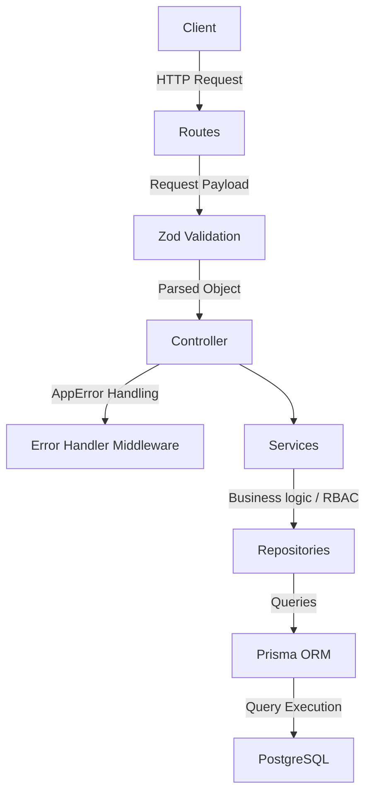
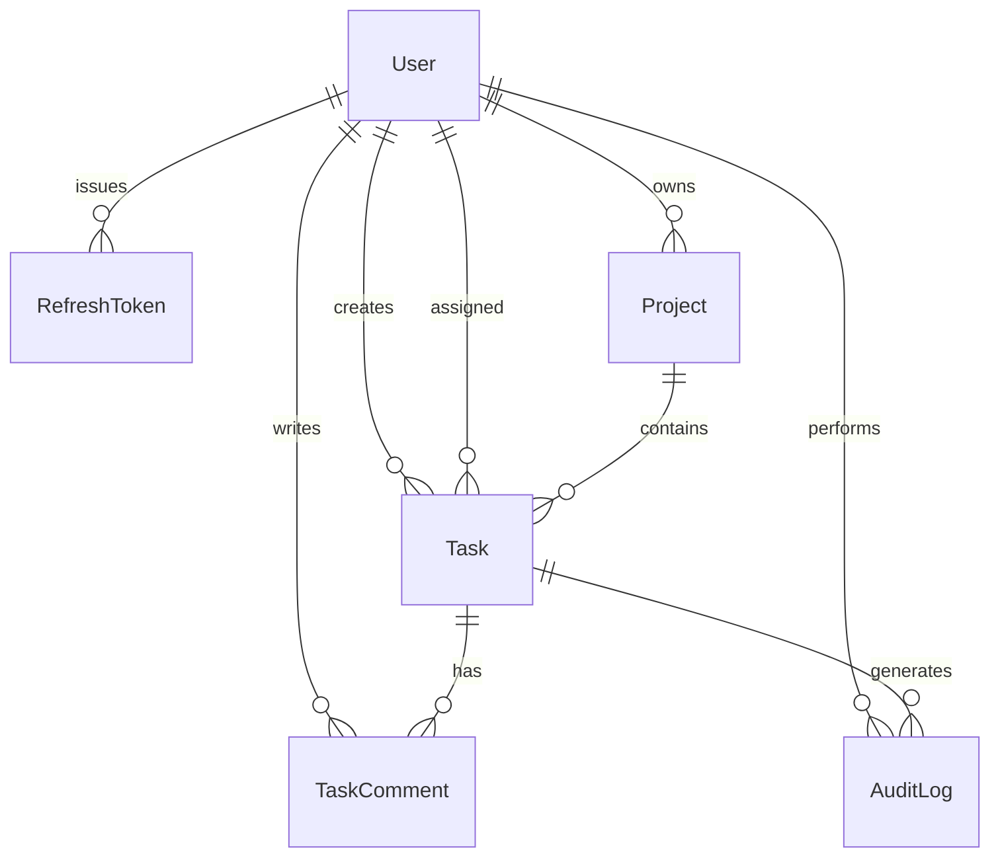

# Application Architecture

This document describes the design patterns, layer roles, database relationships, and security controls used in the Task Assignment API.

---

## 1. Architectural Overview

The application follows a clean, traditional **Layered Architecture**. By segregating responsibilities into distinct layers, we ensure that business rules, request routing, validation, and data persistence remain decoupled and testable.

### Layer Roles
1. **Routes (`src/routes/*`)**: Defines the endpoint URIs and chains the appropriate authentication, validation, and authorization middlewares before delegating to the controller.
2. **Controllers (`src/controllers/*`)**: Reads route parameters, query strings, and payloads. Delegates execution to the services and constructs standard API envelopes for response.
3. **Services (`src/services/*`)**: House all core business logic and state transitions. Enforces security checks (e.g. user authorization boundaries).
4. **Repositories (`src/repositories/*`)**: Contains data-access logic and interacts directly with PostgreSQL via the Prisma Client.
5. **Utils & Configs (`src/utils/*` & `src/config/*`)**: Houses centralized configuration loaders, error classes, and JSON response helpers.

---

## 2. Core Patterns & Practices

### Centralized Error Handling
An Express middleware (`src/middleware/error-handler.js`) intercepts all errors thrown in the controller and service layers. Operational errors (e.g., validation failures, unauthorized access) receive correct semantic HTTP status codes.

### Response Standardization
All JSON responses conform to a predictable envelope:
- **Success**: `{ success: true, data: [...], error: null }`
- **Error**: `{ success: false, data: null, error: { message: "Error msg", errors: [...] } }`

---

## 3. Security Hardening & RBAC

### JWT Authentication with Refresh Token Rotation (RTR)
- **Access Tokens**: Short-lived (15 minutes), containing the user ID, email, and role.
- **Refresh Tokens**: Long-lived (7 days), stored securely in PostgreSQL as a SHA-256 hash.
- **Rotation**: On every token refresh, the old refresh token is immediately deleted/invalidated, and a new refresh token is issued to the client. This mitigates the risk of replay attacks.

### Role-Based Access Control (RBAC) Matrix
Permissions are enforced at the route level via middleware (`rbac.middleware.js`) and further validated inside services when data ownership is required (e.g., project owner checks).

| Action | Admin | Manager | Member |
|---|---|---|---|
| Projects CRUD | ✅ | Owner only | ❌ |
| Tasks Create/Delete | ✅ | Project Owner only | ❌ |
| Tasks Update | ✅ | Project Owner only | Assignee only (Status update only) |
| Task List | ✅ | All tasks | Assigned tasks only |
| Audit Trail View | ✅ | Project Owner only | Assignee only |
| Comments CRUD | ✅ | Project Owner only | Assignee/Author only |

---

## 4. Database Schema Relationships

- **Soft Delete**: Both `Project`, `Task`, and `TaskComment` models feature a `deletedAt` timestamp. Records where `deletedAt != null` are automatically excluded from lists and lookups.
- **Audit Trails**: The `AuditLog` table logs every task status transition (`oldStatus` -> `newStatus`), capturing who changed it and when.
